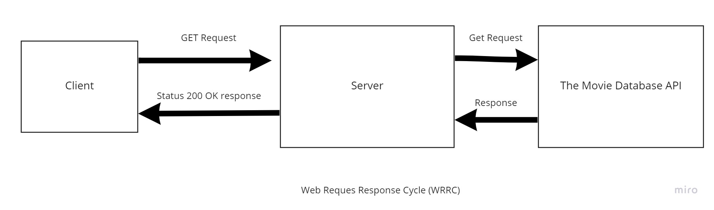

# Movies-Library - version 1.0.0.0
**Author Name**: Mohammad Salameh

## WRRC

## Overview
In This week we will create the backend of our new web application, for now we just learned how to get the data from a json file and call it using an end point "/".

## Getting Started
1. creat a new repository and clone it to your machine
2. use npm init -y to initiate your project
3. use npm install express and then start coding
4. call express and add it to a variable.
5. install your data.
6. create a constructor to reformat your data.
7. add a get request with the required end point and it's handler function
8. now when the end point is called, the handler should respond with the formatted data as required.
9. in this case we also added an end point for favorite, and got "welcome to favorite" as a response.

## Project Features
- "/" gives you the formatted data
- "/favorite" gives you a "welcome to favorite" message